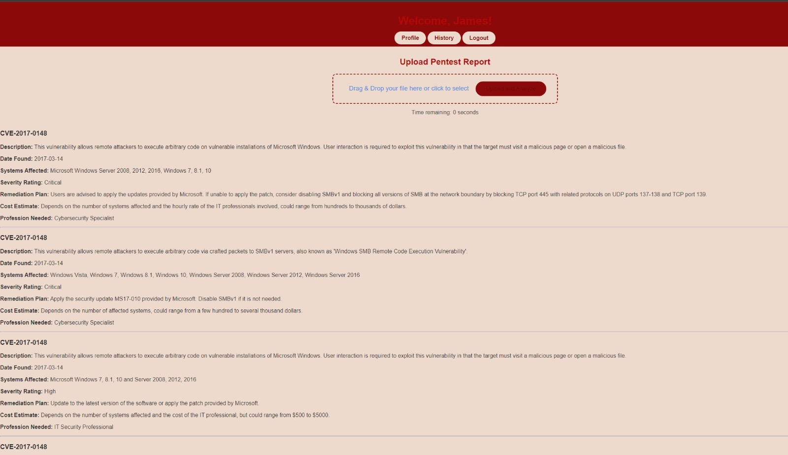

# AI Penetration Test Remediation Plan Generation
## Overview
This project was developed as part of my IPRO (Introduction to the Profession) course at Illinois Institute of Technology in Fall 2024. It is a web-based tool that automates the analysis of PDF-format penetration test reports to generate structured and actionable mitigation plans using OpenAI’s GPT model via the OpenAI API.

Upon uploading a report, the system extracts key information and generates:
* A short description of each identified vulnerability
* A recommended mitigation strategy
* A severity ranking
* An estimated cost of remediation

All outputs are stored in a relational database hosted on AWS RDS, and the website itself is deployed on an AWS EC2 instance. The application is built using Flask for the backend and HTML/CSS for the frontend.
This system streamlines the cybersecurity remediation process by transforming complex penetration testing documents into a clear, prioritized, and budget-aware action plan.

## Key Concept Applied
- **AI-Powered Document Analysis**

  Used OpenAI’s GPT model to extract, summarize, and interpret data from unstructured PDF penetration test reports.
- **Natural Language Processing (NLP)**

  Translated technical vulnerabilities into human-readable, actionable items using GPT-based language generation.
- **Web Development**

  Developed a full-stack web application using Flask for backend logic and HTML/CSS for the frontend interface.
- **File Handling & PDF Parsing**

  Extracted text content from uploaded PDF reports using Python-based PDF parsing libraries
- **Database Integration**

  Stored extracted data, generated plans, and user uploads in a relational database hosted on AWS RDS.
- **Cloud Deployment**

  Deployed the web application on AWS EC2, ensuring remote accessibility and scalable performance.
- **Security Awareness & Risk Prioritization**

  Incorporated severity ranking and cost estimation to support real-world remediation planning.

## Project Structure
### /static/ 
Contains static assets for the project, including:
* CSS Stylesheets
* /media/ - media files used in project

### /templates/
Houses all HTML files used to render the frontend.

### /uploads/
Includes penetration test reports that are used as part of the analysis or data input for the system.

## Tools and Technologies
- **Frontend:** HTML5, CSS3
- **Backend:** Python, Flask
- **AI:** OpenAI API
- **PDF Parser:** pdfminer
- **Database:** AWS RDS (MySQL)
- **Hosting:** AWS EC2

## Preview
**Screen Shot of Webpage**

(📽️ [Watch Demo Video](https://www.youtube.com/watch?v=your_video_id)
)

## Team
- Vincent Richardo: Database design, frontend development, AI integration
- Andrew Danda: Frontend development, AI integration, AWS hosting and deployment
- Adil Ghoghawala: Frontend development, AI integration
- Jack Jarjourah: Cybersecurity analysis and penetration test report expertise
- Nicole Cabezas: UI/UX design, business strategy, and documentation
